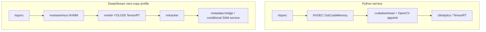

# Architecture and engineering decisions

## Runtime data plane

Each stage owns a bounded queue of size two. Producers never wait for a slow consumer: they replace the oldest pending frame and increment `sentinel_frames_dropped_total{stage=...}`. This preserves a bounded live-view age during bursts, camera jitter, SAM invocations, and temporary GPU contention.

1. **Ingest** timestamps a frame with wall and monotonic clocks. RTSP uses TCP, a configurable jitter buffer, parser, hardware/software decoder, colorspace conversion, and a one-buffer dropping appsink.
2. **Pose** lazily loads a YOLO26 pose artifact and warms it before declaring readiness. The adapter preserves boxes, confidence, and all keypoints.
3. **Tracking** associates detections through ByteTrack. Pose keypoints are reattached by maximum IoU to tracked boxes.
4. **Enrichment** asks the segmentation scheduler which tracks justify SAM 2 cost, updates per-ID skeleton histories, classifies actions, renders overlays, and emits transition events.
5. **Narrative** consumes warning/critical events on an independent bounded queue. Ollama output can enrich text but cannot modify severity, action, or confidence.

`StateStore` is the single read model for HTTP/WebSocket consumers. Raw frames are not persisted. Events use a configured bounded in-memory history.

## CUDA deployment boundary

There are two supported deployment shapes:

The Python path is portable and easier to inspect. It incurs a device-to-host and later host-to-device transfer. The DeepStream shape is the correct choice when PCIe transfer or multi-camera 4K density dominates; it needs a YOLO26 pose output parser compiled against the deployed TensorRT/DeepStream versions. The repository does not label the portable path “zero-copy.”

OpenCV wheels are frequently built without GStreamer. Startup detects this condition and falls back to OpenCV's FFmpeg backend so file/RTSP ingestion remains functional; readiness names that backend and reports the loss of hardware decode. A GStreamer-capable OpenCV build or native PyGObject binding is required to exercise the configured pipeline.

## Concurrency and ordering

Pose, tracking, and enrichment are separate tasks. Tracking remains sequence-ordered even while ingest replaces pending frames. A single stage never processes two frames concurrently, preventing out-of-order track state. Model calls run off the asyncio event loop.

## Failure policy

- Production configuration rejects fallback backends during validation.
- Missing TensorRT engines and temporal checkpoints fail before accepting traffic.
- An unhandled stage error sets readiness to false and stops upstream work.
- RTSP end-of-stream reconnects with bounded exponential backoff.
- Ollama failures are warnings and never stop inference.
- The safe config view redacts URI userinfo.

## Extension points

`VideoSource`, `PoseEstimator`, `Tracker`, `Segmenter`, and `ActionClassifier` are narrow abstract interfaces. Replacing an implementation does not alter orchestration or API contracts. A site-specific animal skeleton should introduce a schema/normalizer pair rather than pretending COCO-17 semantics apply.
